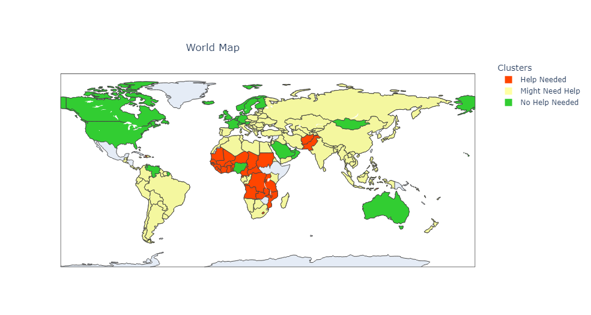

# Clustering Countries Based on Socio-Economic Metrics

## Problem Statement
Identifying countries in need based on socio-economic and health metrics is paramount for targeted global aid and policy-making. This project utilizes unsupervised machine learning to cluster countries, ascertaining which ones require immediate assistance and which are relatively stable. The aim is to provide a data-driven approach to international aid prioritization.

## Technical Highlights and Key Learnings

- **Advanced Data Exploration**:
  - Utilized `matplotlib` and `seaborn` to visualize feature relationships, particularly between metrics like child mortality, income, GDP, exports, and health expenditure.

- **Proficient Feature Engineering**:
  - Streamlined the dataset by categorizing metrics into overarching categories: health, trade, and finance. Developed composite features by averaging related metrics.

- **Data Scaling and Dimensionality Reduction**:
  - Normalized features using `MinMaxScaler` and applied Principal Component Analysis `(PCA)` for effective dimensionality reduction.

- **Clustering and Analysis**:
  - Applied the `K-Means` clustering algorithm and strategically labeled clusters based on their developmental needs.

- **Advanced Data Visualization**:
  - Made advanced visualizations like the interactive world map heatmap and 3D scatterplot using `Plotly` and `Kaleido`.

- **Technologies and Libraries Used**: 
  - Demonstrated proficiency with libraries such as `pandas`, `matplotlib`, `seaborn`, `sklearn`, `plotly`, and `yellowbrick`.

## Findings & Visualizations

The project's highlight is an interactive world map heatmap, illustrating the distribution of countries based on their clustering results. 

[Click here to explore the interactive world map heatmap!](https://KgKevin0.github.io/Clustering-Countries-In-Need/cluster_worldmap.html)

Key Insights from the heatmap:
- **Help Needed**: Regions highlighted in red represent countries facing significant socio-economic challenges, including high child mortality rates.
- **Might Need Help**: Yellow regions denote countries that, while better off than the red ones, still require assistance.
- **No Help Needed**: Green regions indicate countries that are relatively stable based on the considered metrics.

## Dataset Overview

The dataset, sourced from [Kaggle.com](https://www.kaggle.com/datasets/rohan0301/unsupervised-learning-on-country-data), offers a granular look into the socio-economic and health landscapes of 167 countries. With 10 distinct variables for each country, it paints a detailed picture of global development:

- **Child Mortality**: The death of children under the age of 5 per 1000 live births, serving as a critical indicator of a country's healthcare and overall well-being.
- **Exports**: The exports of goods and services as a percentage of the total GDP, reflecting a country's trade health.
- **Health**: The total health spending as a percentage of GDP, indicative of a country's priority on healthcare.
- **Imports**: The imports of goods and services as a percentage of GDP, providing insights into a country's consumption behavior and trade dependencies.
- **Income**: The net income per person, a straightforward metric of a country's economic status.
- **Inflation**: The measurement of the annual growth rate of the Total GDP, offering insights into the economic stability of a country.
- **Life Expectancy**: The average number of years a newborn child would live if current mortality patterns were to stay the same, often used as a measure of a country's health and well-being.
- **Total Fertility**: The number of children that would be born to each woman if the current age-fertility rates remain the same.
- **GDPP**: The GDP per capita, serving as an indicator of the economic health of a country.
  
By delving into these metrics, the project offers a holistic perspective on global development patterns, identifying countries that thrive and those in dire need of assistance.

## Contribution & Feedback

Passionate about data science and continuous learning, I welcome feedback from industry professionals, recruiters, and peers. Your insights can help refine the project further. Please feel free to share your thoughts or suggestions.

## License
This project is under the MIT License. Open for sharing, adaptation, and collaboration with proper attribution.
